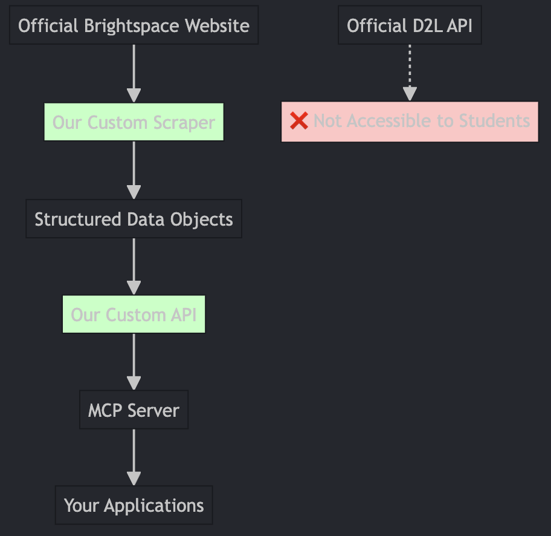

# McGill myCourses MCP Server

A Model Context Protocol (MCP) server that gives Claude Desktop access to your **McGill University myCourses** (Brightspace) account — ask Claude about your courses and upcoming deadlines in plain language.

> **Unofficial project.** Not affiliated with McGill University or D2L Corporation. This is a personal-use scraper/integration built by a student, for students — use it to read your own data, and be mindful of McGill's terms of service.

## Overview

Students don't get API access to Brightspace, so this project automates the actual browser flow with [Playwright](https://playwright.dev/) — including McGill's Microsoft (Entra ID) single sign-on and MFA — to pull real data out of myCourses, and exposes it to Claude Desktop as MCP tools.

It started as a fork of a Purdue-specific Brightspace scraper and has been rebuilt end-to-end for McGill: different login flow (Microsoft SSO instead of Duo), different DOM (McGill's Brightspace theme doesn't match Purdue's), and a McGill-specific bonus — a calendar-feed integration that turns out to be more reliable than scraping assignments page-by-page.



## What works right now

Everything below has been tested against a live McGill account, not just written and hoped for:

| Tool | What it does | How |
|---|---|---|
| `get_courses` | Lists your enrolled courses (name, code, URL) | Scrapes the myCourses home page course widget |
| `get_calendar` | Upcoming/recent deadlines across **every** course at once, each labeled with its course code | Fetches McGill's personal iCal feed directly — no login needed |
| `get_assignments` | Due dates/status/scores for one specific course | Scrapes that course's Dropbox page |
| `hello` | Connectivity smoke test | — |

**Login handles the hard part automatically.** McGill's SSO chain is: myCourses → a "McGill" SSO link (styled like a button, actually a plain `<a>`) → Microsoft's login → a TOTP code you type in yourself (not a phone-tap push) → optional "Stay signed in?" prompt → back to myCourses. The server:
- Detects when a session is already cached and skips the login entirely (no browser window, no MFA prompt) — this is the common case.
- When a *real* login is actually needed, automatically pops up a visible browser window just for that step (Playwright can't toggle headless mode on a running browser, so it transparently relaunches non-headless), then goes invisible again for every call after.
- Caches the authenticated session to disk so MFA is only needed occasionally, not on every query.

## Setup

### Prerequisites
- Python 3.12 (Playwright/greenlet compatibility; 3.13 has known issues)
- A McGill account with myCourses access, and Microsoft Authenticator configured for TOTP codes on it
- [Claude Desktop](https://claude.ai/download)

### Install

```bash
git clone <this-repo-url>
cd mcgill-mycourses-mcp
python3 setup.py    # creates a venv, installs deps + Playwright's Chromium, writes a .env template
```

### Configure `.env`

```bash
MCGILL_USERNAME=your_mcgill_username_or_email
MCGILL_PASSWORD=your_mcgill_password

# Leave this True. login() auto-detects when a real login is actually needed
# and pops up a window just for that step - see "What works right now" above.
HEADLESS=True

# Where the authenticated session is cached between runs.
SESSION_STATE_PATH=.mcgill_session.json

# Optional but recommended - powers get_calendar (see below).
MCGILL_ICAL_URL=
```

**Getting `MCGILL_ICAL_URL`:** in myCourses, open Calendar → **Subscribe** → "All Calendars and Tasks" → copy the feed URL. It looks like `https://mycourses2.mcgill.ca/d2l/le/calendar/feed/user/feed.ics?token=...`.

> ⚠️ **That URL's token is a bearer credential** — anyone who has it can read your entire calendar with no further login. Treat it exactly like a password: never commit it, paste it publicly, or share it. If it's ever exposed, reset it from the same Subscribe dialog (invalidates the old link).

### Connect to Claude Desktop

Copy `claude_desktop_config.example.json`'s contents into your Claude Desktop config (Settings → Developer → Edit Config → `claude_desktop_config.json`), with absolute paths to this repo's `venv/bin/python` and `mcp_server.py`. Restart Claude Desktop completely.

### First run

Just ask Claude something like "what courses am I taking?" — the first call will pop up a browser window for you to type your Authenticator code into (see above). After that, everything's cached and invisible.

If you'd rather verify the login flow standalone first: `python testing/playwright_trial.py` walks through it step by step, screenshotting after each one — useful if McGill's SSO markup ever changes and selectors need adjusting.

## Security notes

- `.env` (credentials) and `.mcgill_session.json` (live session cookies) are both git-ignored — never commit them.
- The calendar feed token is equally sensitive; see above.
- This project only ever reads your own data with your own credentials, run locally on your machine. It doesn't send anything to a third-party server.

## How it's built

- **`brightspace_api.py`** — the scraper/client. `BrightspaceScraper` (Playwright-driven, handles login/courses/assignments) plus standalone calendar-feed functions (`fetch_calendar_events`, `filter_events_by_range` — plain HTTP, no browser).
- **`mcp_server.py`** — wires the above into MCP tools Claude Desktop can call, using the `mcp` Python SDK's `MCPServer` (2.x).
- **`testing/playwright_trial.py`** — a standalone, always-visible login smoke test, useful for debugging if McGill changes something.

## Troubleshooting

- **Login fails / times out** — check for a `login_*_debug.png` screenshot dropped in the project root; it shows exactly which step it got stuck on. Microsoft's SSO markup can vary by tenant/config, so selectors in `brightspace_api.py`'s `login()` may need small adjustments.
- **No courses/assignments found** — myCourses' DOM can change between semesters/theme updates. `get_courses`/`get_assignments` fall back to a debug screenshot (`homepage_debug.png` / equivalent) on failure — compare it against the selectors in the code.
- **Stale session** — delete `.mcgill_session.json` and retry; a fresh login (with its one-time visible window) will run automatically.
- **MCP server not showing up in Claude** — verify the paths in your config are absolute, check Python version, restart Claude Desktop, and check `~/Library/Logs/Claude/` for errors.

## Roadmap / good first issues

Contributions welcome, especially from other McGill students who want their own courses to be the test case:

- **Multi-term `get_courses`** — right now it only sees whichever term tab was last active in your session (usually the current term). McGill's course widget has per-term tabs (`[2025.09] Fall 2025`, etc.) that a `term` parameter could select before scraping.
- **Grades** — not implemented at all yet.
- **Announcements** — not implemented at all yet.
- **Content/Lessons browsing** — the calendar feed surfaces content *release* dates, but doesn't fetch the actual content/readings.
- **`get_assignments` hardening** — it's built against one course's real Dropbox HTML, but assignment layouts can vary (group vs. individual, categories, etc.) — more courses' worth of testing would help.
- **Non-McGill D2L/Brightspace tenants** — the login flow (Microsoft SSO, TOTP-in-page, McGill's specific SSO link markup) is fairly McGill-specific. Other schools' Brightspace instances likely need their own login adapter, though `get_courses`'s D2L-widget scraping may transfer more directly.

If you fix something, a PR with a short note on what you tested it against (course, term) is more valuable than a large refactor with no verification — this codebase has already been burned once by shipping unverified selectors.

## Credits

Forked from an original Purdue-focused Brightspace MCP server and substantially rewritten for McGill's login flow, DOM, and calendar system. Built with [Playwright](https://playwright.dev/) and the [Model Context Protocol](https://modelcontextprotocol.io/) Python SDK.

## License

Apache License 2.0 — see [LICENSE](LICENSE).
